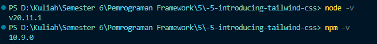
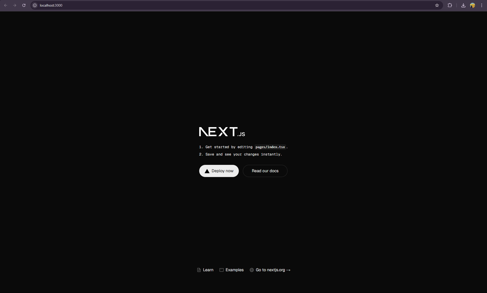
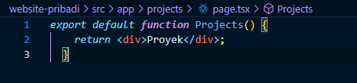

This is a [Next.js](https://nextjs.org) project bootstrapped with [`create-next-app`](https://nextjs.org/docs/app/api-reference/cli/create-next-app).

## Getting Started

First, run the development server:

```bash
npm run dev
# or
yarn dev
# or
pnpm dev
# or
bun dev
```

Open [http://localhost:3000](http://localhost:3000) with your browser to see the result.

You can start editing the page by modifying `app/page.tsx`. The page auto-updates as you edit the file.

This project uses [`next/font`](https://nextjs.org/docs/app/building-your-application/optimizing/fonts) to automatically optimize and load [Geist](https://vercel.com/font), a new font family for Vercel.

## Learn More

To learn more about Next.js, take a look at the following resources:

- [Next.js Documentation](https://nextjs.org/docs) - learn about Next.js features and API.
- [Learn Next.js](https://nextjs.org/learn) - an interactive Next.js tutorial.

You can check out [the Next.js GitHub repository](https://github.com/vercel/next.js) - your feedback and contributions are welcome!

## Deploy on Vercel

The easiest way to deploy your Next.js app is to use the [Vercel Platform](https://vercel.com/new?utm_medium=default-template&filter=next.js&utm_source=create-next-app&utm_campaign=create-next-app-readme) from the creators of Next.js.

Check out our [Next.js deployment documentation](https://nextjs.org/docs/app/building-your-application/deploying) for more details.


---

<br>

# Laporan Praktikum

|       | Pemrograman Berbasis Framework 2025 |
| ----- | ----------------------------------- |
| NIM   | 2241720053                          |
| Nama  | M. Tryo Bagus Anugerah Putra        |
| Kelas | TI - 3C                             |

## Praktikum 1: Persiapan Lingkungan

1. Pas kan Node.js dan npm sudah terinstal di komputer Anda. Anda dapat memeriksanya dengan menjalankan perintah berikut di terminal atau command prompt:


2. Buat direktori baru untuk proyek Next.js Anda:


3. Inisialisasi proyek Next.js dengan TypeScript dan App Router:


4. Cek konfigurasi postcss.config.mjs:


5. Cek di app/globals.css, sudah ada import untuk tailwindcss:


6. Buka app/layout.tsx, tambahkan import './globals.css', dan modifikasi menjadi sebagai berikut:


7. Jalankan aplikasi Next.js:



## Praktikum 2: Membuat Halaman Website

Website pribadi akan memiliki ga halaman: 
- **Tentang Saya**: Halaman berisi profil singkat dan link ke media sosial. 
- **Proyek**: Halaman untuk menampilkan proyek-proyek yang telah diselesaikan. 
- **Esai**: Halaman untuk menampilkan daftar artikel yang telah ditulis. 

**Langkah-langkah:**

1. Buat file app/page.tsx sebagai halaman "Tentang Saya":


2. Buat file app/projects/page.tsx sebagai halaman "Proyek":


3. Buat file app/essays/page.tsx sebagai halaman "Esai":


4. Buka browser dan akses: 
    - http://localhost:3000/ untuk halaman "Tentang Saya". 
    
    
    - http://localhost:3000/projects untuk halaman "Proyek".
    

    - http://localhost:3000/essays untuk halaman "Esai".
    


## Praktikum 3: Membuat Layout dan Navigasi

Layout digunakan untuk menyediakan struktur yang konsisten di seluruh halaman, seperti navbar dan footer. 

**Langkah-langkah:**

1. Buat direktori src/components jika belum ada.

2. Buat file src/components/Layout.tsx:


3. Buat file src/components/Navbar.tsx


4. Buat file src/components/Footer.tsx 


5. Update file app/layout.tsx untuk menggunakan layout:


6. Update se ap halaman menambahkan metadata dengan generateMetadata: 

   Lakukan hal yang sama untuk halaman projects/page.tsx dan essays/page.tsx. 


### Halaman "Tentang Saya"


### Halaman "Proyek"


### Halaman "Esai"


